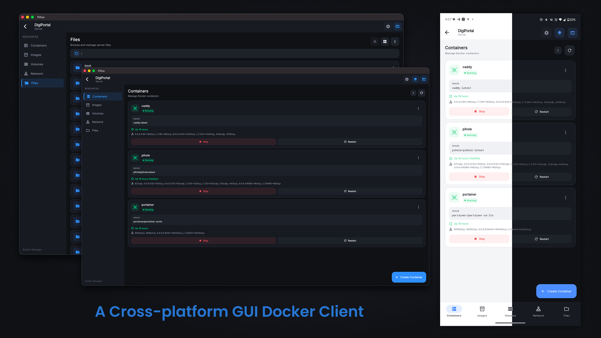

<div align="center">

# Pillus

**Klien GUI Docker lintas platform untuk mengelola server Docker jarak jauh melalui SSH/SFTP.**

<p>
  
</p>

<p>
  <strong>Manajemen Docker • SSH/SFTP • File Manager • Terminal • Docker Compose</strong>
</p>

</div>

---

## Tentang Pillus

Pillus adalah aplikasi Flutter untuk mengelola server Docker dari jarak jauh melalui **SSH/SFTP**.

Alih-alih membuka Docker socket secara langsung, Pillus terhubung ke server melalui SSH dan menyediakan antarmuka grafis untuk mengelola container, image, volume, network, project Docker Compose, file, serta terminal server.

## Fitur

| Kategori | Fitur |
|---|---|
| 🐳 **Docker** | Kelola container, image, volume, dan network |
| 📦 **Container** | Daftar, start, stop, restart, pause, logs, stats, dan inspect |
| 💻 **Exec** | Jalankan perintah langsung di dalam container |
| 📁 **File Manager** | Upload, download, rename, hapus, dan buat folder melalui SFTP |
| 📝 **Editor** | Edit file konfigurasi dan file teks langsung di server |
| 🧩 **Docker Compose** | Daftar project, `up`, `down`, dan edit file Compose |
| ⌨️ **Terminal** | Shell interaktif server |
| 🔐 **Keamanan** | Penyimpanan kredensial menggunakan `flutter_secure_storage` |
| 🌐 **Bahasa** | Indonesia, English, 中文, 日本語 *(pengujian)* |
| 🌙 **Tema** | Tema gelap |

## Persyaratan

- Flutter SDK — versi yang ditentukan di `pubspec.yaml`
- Dart SDK `^3.12.2`
- **iOS / macOS:** macOS + Xcode
- **Android:** Android SDK
- **Server jarak jauh:** Docker terpasang dan akses SSH tersedia

## Instalasi

```bash
git clone https://github.com/Appsventory/Pillus-Container.git
cd pillus
flutter pub get
flutter run
```

## Struktur Project

```text
lib/
├── main.dart
├── l10n/                 # Lokalisasi
├── models/               # Model data
├── providers/            # State management Riverpod
├── screens/              # Halaman UI
├── services/             # SSH, SFTP, Docker, penyimpanan
├── theme/                # Tema aplikasi
└── widgets/              # Widget yang dapat digunakan kembali

assets/
├── icon/
└── splash.png
```

## Dependensi Utama

| Package | Kegunaan |
|---|---|
| `dartssh2` | Koneksi SSH & SFTP |
| `flutter_riverpod` | State management |
| `flutter_secure_storage` | Penyimpanan password/private key secara aman |
| `file_picker` | Memilih file untuk upload |
| `path_provider` | Menentukan path lokal untuk download |
| `xterm2` | Emulator terminal |
| `google_fonts` | Font aplikasi |

## Cara Penggunaan

1. Tambahkan server menggunakan **host, port, username, dan password atau private key**.
2. Hubungkan ke server melalui SSH.
3. Kelola **container, image, volume, network, dan file** melalui dashboard.
4. Gunakan **File Manager** untuk menjelajah dan mengedit file teks/konfigurasi langsung di server.
5. Gunakan **Terminal** ketika membutuhkan akses shell secara langsung.

## Keamanan

- Kredensial disimpan menggunakan penyimpanan perangkat terenkripsi.
- Periksa fingerprint host SSH saat koneksi pertama.
- Jangan membagikan private key atau file keystore.


---

<div align="center">

<strong>Made with ♥︎ by ICK Network Team</strong>

</div>
